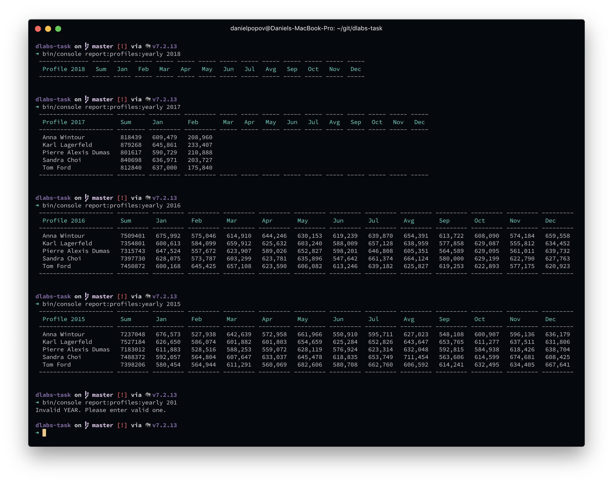

SOLUTION
========

Estimation
----------
Estimated: 4-5 hours

Spent: 3 hours

Solution
--------
Comments on your solution

So, I finished somehow, but I have to tell that I'm not that fluent in PHP and Symfony. I've been working for 3+ years with Go, Python and Node. Task in PHP was a small challenge for me.
I guess that in a 'proper' way I would use DI from Sympfony classes to write good code.
But I did this task mostly in plain SQL, coz It's what I remember from University, if you don't know some frameworks or language features - use plain SQL. I found most of my needs on w3schools.com.

After 1h reading of documentation I found out how to add argument to this program and how to arrange the table. After that I started putting queries to Sequel Pro, this is just a tool for managing the databases. Coded till the firsts result in 1h hour, after I spent extra 30mins to fix some bugs and add `try{}catch{}`.

I had an experience with some analytics in a past, I used Python3, SQL and pandas. In my opinion when you work with small data you can you some dataframe frameworks to speed up your development time. If you work with extremely large data - SQL. For better scalability or 'pair programming' I would split it in micro-services. If you are using some kind of ORM it's better to use it in REST api way, some server with fast JSON responses.

Test cases: 

Wrong year
```sh
bin/console report:profiles:yearly 201

Invalid YEAR. Please enter valid one.
```

Good case
```sh
 bin/console report:profiles:yearly 2016
 
 Everything as expected
 ```
 
 Data is missing
 ```sh
 bin/console report:profiles:yearly 2014
 
 Everything as expected, if data is not available you will see empty boxes.
 ```
 
 Features:
 
1. Definitely I would add visualization 
2. I would make this app in rest api way with a client (Vue, React, etc)
3. I would try to implement showing sum for custom period as on Google analytics.

